<div align="center">

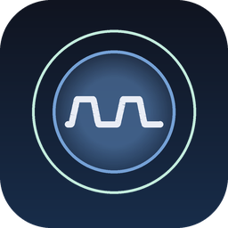

# BreathingCoach

**Guided breathing training with live capnography biofeedback on macOS,
reading EtCO₂ from a Capnostream monitor via [CapnostreamKit](https://github.com/LinkAndreas/CapnostreamKit).**

[](https://github.com/LinkAndreas/BreathingCoach/actions/workflows/ci.yml)
[](LICENSE)
[](#requirements)
[](https://developer.apple.com/swift/)

</div>

> [!IMPORTANT]
> **BreathingCoach is not a medical device.** It is an educational and personal-training tool that
> visualizes data from a connected capnograph. It does not diagnose, treat, cure, or prevent any
> condition, it is not certified under MDR/FDA rules, and it must never be used for clinical
> monitoring or to make medical decisions. Always follow your monitor's own display and your
> clinician's advice. See [Safety and intended use](#safety-and-intended-use).

## What it does

BreathingCoach turns a Capnostream capnography monitor into a breathing-training biofeedback loop.
You pick a breathing technique, follow the on-screen pacer, and watch your end-tidal CO₂ (EtCO₂),
respiration rate and SpO₂ respond in real time — then review how the session went.

The serial link to the monitor — port discovery, the handshake and the streaming protocol — is
handled by [**CapnostreamKit**](https://github.com/LinkAndreas/CapnostreamKit), a separate Swift
package. This repository is the app on top of it.

**No capnograph?** Turn on [demo mode](#demo-mode) from the Connect screen and the whole app runs on
simulated readings.

- **Connect** — discover serial/USB devices, run the handshake, and follow the connection with a
  live console log and status pill.
- **Live session** — an animated pacer drives inhale / hold / exhale / hold segments while the CO₂
  waveform, EtCO₂ card, in-target card and trend sparkline stream alongside it.
- **Techniques** — CART, Coherent Breathing, Buteyko reduced breathing, pursed-lip breathing, 4-7-8,
  and a custom pace derived from your own breaths-per-minute setting.
- **Guide** — what each technique is for, its segment timings, and step-by-step instructions.
- **Summary & history** — a per-session chart and stats, plus a browsable list of past sessions.
- **Settings** — units, EtCO₂ target range, custom pace, guide preferences, and onboarding replay.

## Screenshots

> Captured in demo mode, so every reading below is **simulated** — see [Demo mode](#demo-mode).
> The app labels this clearly on screen with the `DEMO DATA` badge.

| Live session | Session summary |
|---|---|
| 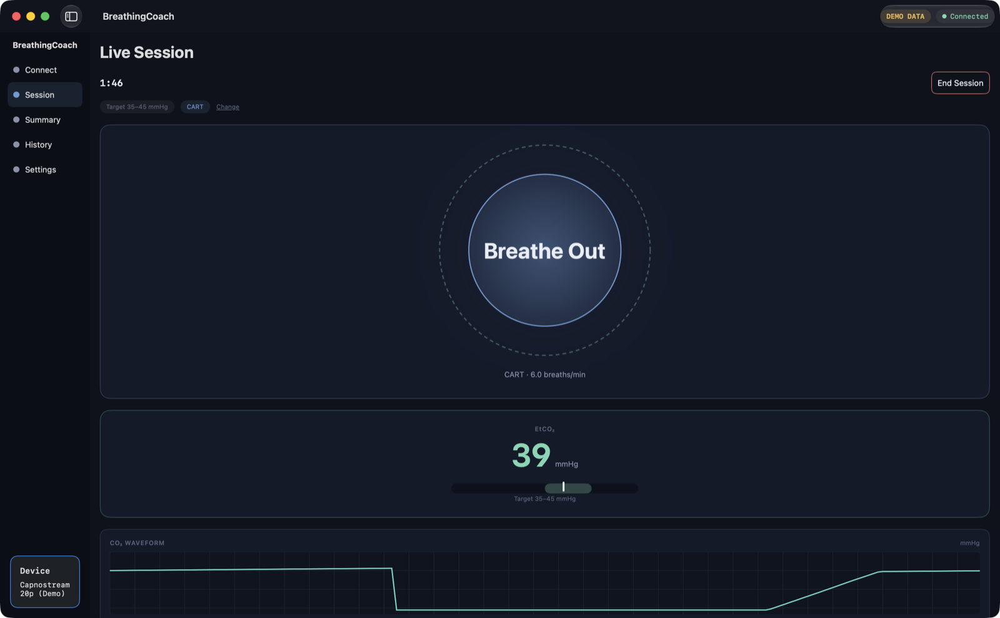 | 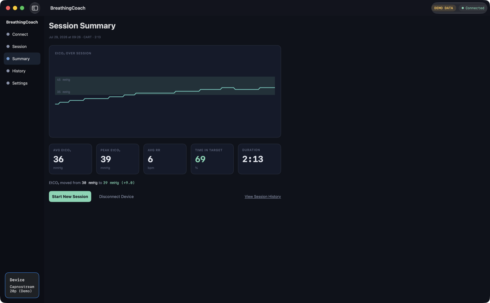 |
| The pacer drives the breath while EtCO₂ streams live. | How the session went, start to finish. |

| Waveform and stats | Technique picker |
|---|---|
| 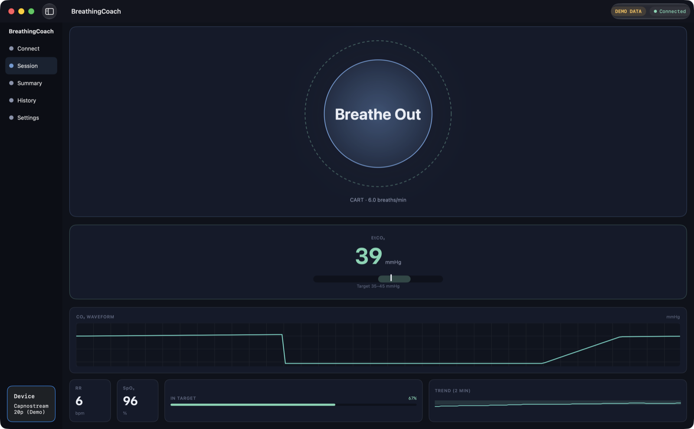 | 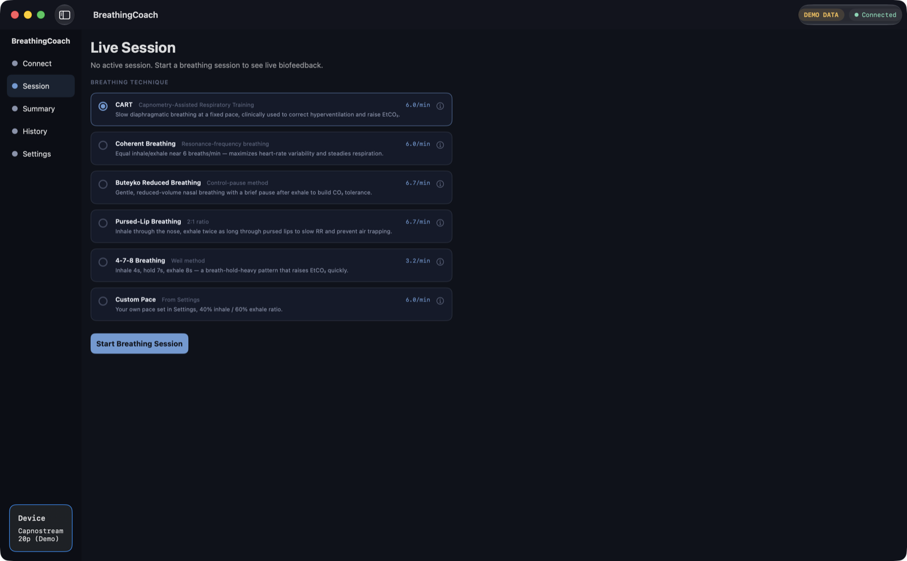 |
| The capnogram with RR, SpO₂, time in target and trend. | Pick a technique and its pace before starting. |

| Device discovery | Connected |
|---|---|
| 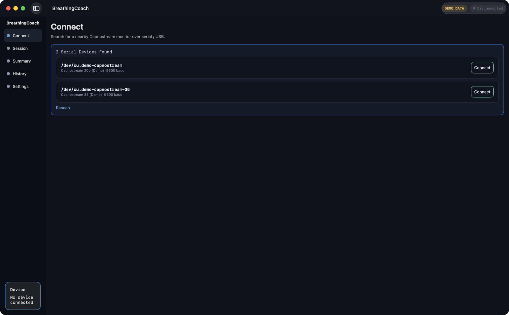 | 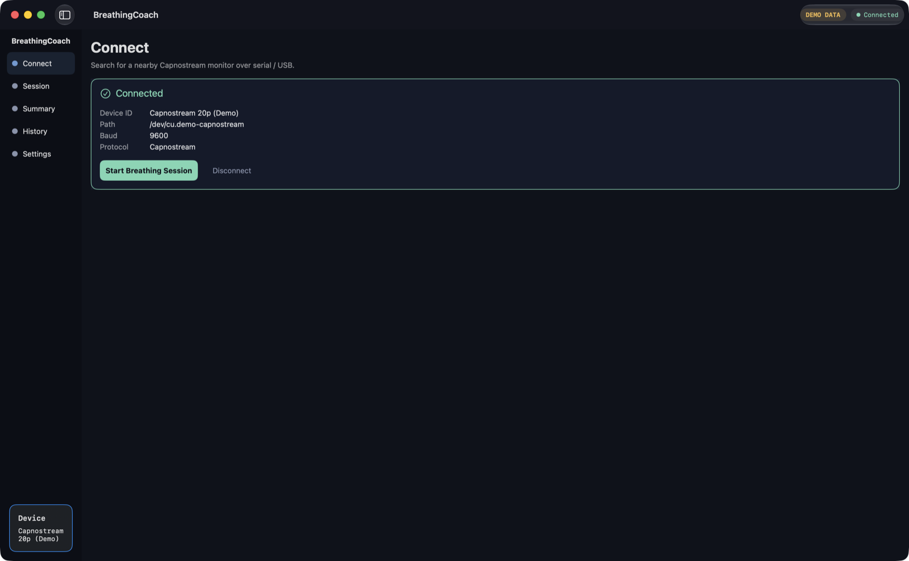 |
| Scan for monitors on serial / USB. | Device details, then straight into a session. |

| Technique guide | Settings |
|---|---|
| 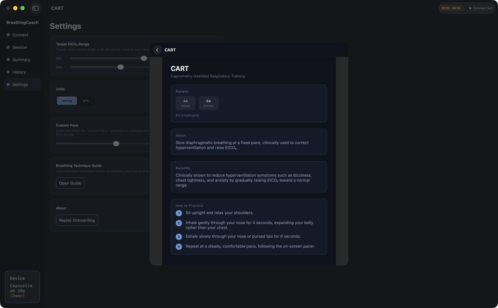 | 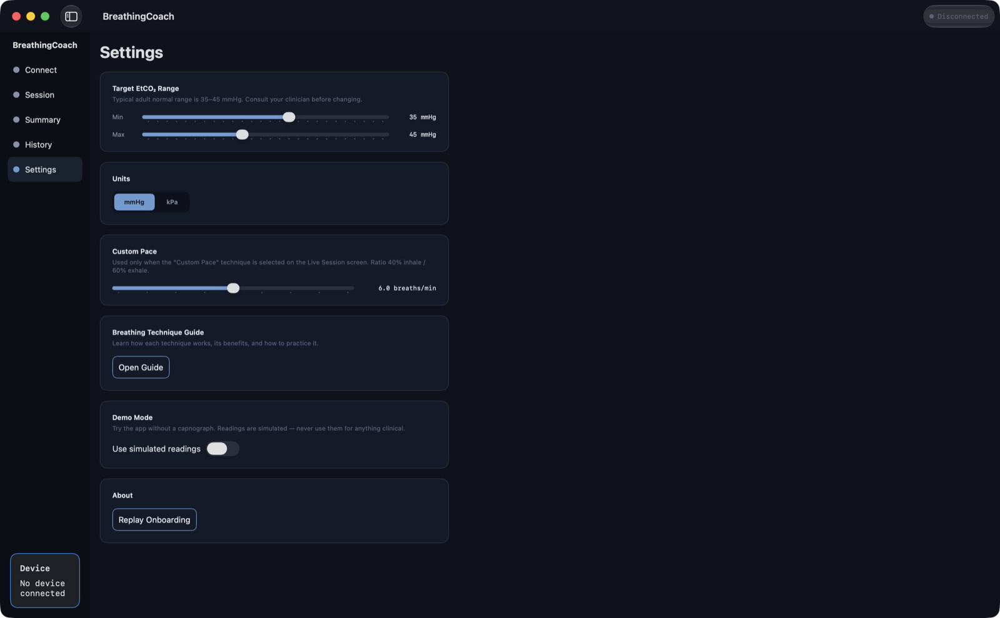 |
| What each technique does, and how to practise it. | Target range, units, custom pace. |

| Session history | Onboarding |
|---|---|
| 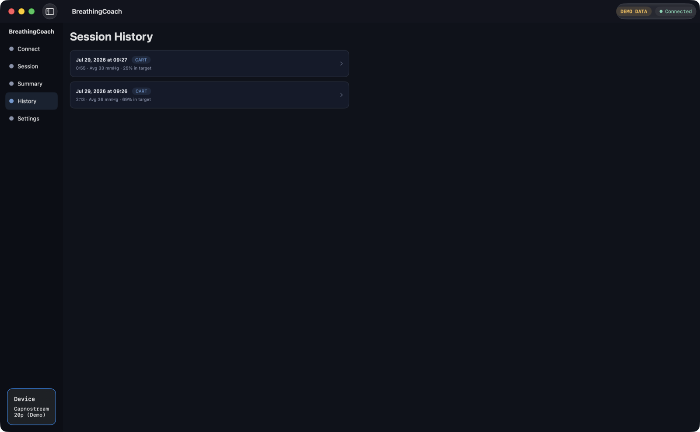 | 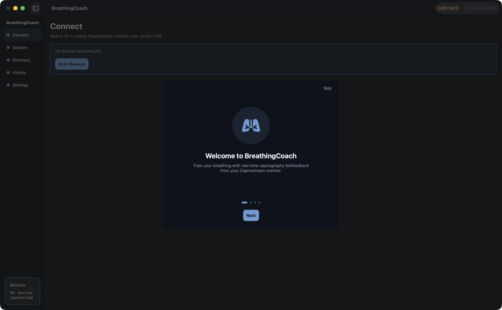 |
| Every session completed this run. | A short introduction on first launch. |

## Requirements

| | |
|---|---|
| macOS | 27.0 or later |
| Xcode | 27.0 or later |
| Hardware | A Medtronic/Oridion **Capnostream** monitor reachable over serial or USB |

The app is macOS-only (`SUPPORTED_PLATFORMS = macosx`, Mac Catalyst off). It runs without the app
sandbox because it talks to a serial device, and requests USB and Bluetooth resource access.

## Getting started

```bash
git clone https://github.com/LinkAndreas/BreathingCoach.git
```

Open `BreathingCoach.xcodeproj`, let Xcode resolve the Swift packages, select the **BreathingCoach**
scheme and run. Or from the command line:

```bash
xcodebuild -project BreathingCoach.xcodeproj -scheme BreathingCoach -destination 'platform=macOS' build
```

You can explore the whole UI without hardware — connect screens, guide, settings and onboarding all
work; only live data requires a monitor.

## Demo mode

Everything past the Connect screen needs a monitor streaming data. Demo mode stands in for one: it
serves fake devices, fakes the handshake, and generates a shaped capnogram plus matching EtCO₂, RR
and SpO₂ — so you can try the full flow, or develop the session screens, with no hardware at all.

Turn it on either way:

- **In the app** — press **Try Demo Mode** on the Connect screen, or use the switch in Settings.
  The choice is remembered between launches; turning it off disconnects the fake device.
- **At launch** — useful for development and for scripted screenshots:

  ```bash
  open -n BreathingCoach.app --args -BCDemoMode YES
  ```

  In Xcode, add `-BCDemoMode YES` to the scheme's launch arguments.

It is **off** unless asked for at launch, the fake devices are named `(Demo)`, and while it is on the
window shows a `DEMO DATA` badge — readings a user could mistake for real measurements are the one
thing this app must never produce. The generator lives in
[`DemoMode.swift`](BreathingCoach/Model/DemoMode.swift); nothing in it is measured.

## Dependencies

Both are resolved via Swift Package Manager and pinned in `project.xcworkspace/xcshareddata/swiftpm/Package.resolved`.

| Package | Purpose |
|---|---|
| [CapnostreamKit](https://github.com/LinkAndreas/CapnostreamKit) | Capnostream serial protocol and device access |
| [NavigationKit](https://github.com/LinkAndreas/NavigationKit) | Split/stack navigators and route-builder driven routing |

## Project structure

```
BreathingCoach/
├─ BreathingCoachApp.swift   App entry point and window scene
├─ ContentView.swift         Split navigation shell, onboarding gate, toolbar
├─ MenuItems.swift           Sidebar menu definitions
├─ Model/                    Cross-feature models, e.g. the EtCO₂ display unit
├─ Routes/                   SidebarRoute and DetailRoute
├─ RouteBuilder/             Route → view construction
├─ Components/               Reusable UI: buttons, menu, status pill, device indicator
├─ Extensions/               Color palette, hex/adaptive colors, small value helpers
└─ Features/
   ├─ Onboarding/            First-run paged introduction
   ├─ Connect/               Device discovery, handshake, console, connection states
   ├─ Session/               Pacer, technique models, live cards and waveform
   ├─ Guide/                 Technique guide and timings
   ├─ Summary/               Post-session summary and chart
   ├─ History/               Past sessions list and detail
   └─ Settings/              Units, target range, custom pace, about
```

Views are SwiftUI, state is `@Observable`/`@State`-driven, and navigation is route-based rather than
view-nested. `BreathingPacer` is deliberately pure and stateless so it can be driven straight from a
`TimelineView`, and `DisplayUnit` owns every mmHg/kPa conversion and format so all screens agree.
All user-facing copy lives in `Localizable.xcstrings`, localized in English, German, Spanish and French.

## Safety and intended use

BreathingCoach is intended for personal wellness, education and experimentation. It is **not** a
medical device and carries no regulatory clearance of any kind.

- Do not use it for clinical monitoring, alarms, or any decision about care.
- Displayed values may lag, drop out, or be wrong — the monitor's own display is authoritative.
- Breath-hold techniques (4-7-8, Buteyko) are not appropriate for everyone. Stop immediately if you
  feel dizzy, faint or unwell, and talk to a clinician before starting any breathing programme,
  especially with a respiratory, cardiac or anxiety-related condition.
- The software is provided "as is", without warranty of any kind, as set out in the [LICENSE](LICENSE).

## Contributing

Contributions are welcome — see [CONTRIBUTING.md](CONTRIBUTING.md) for the branching model
(git-flow: work off `develop`, releases land on `main`), commit conventions and PR expectations.
Please also read the [Code of Conduct](CODE_OF_CONDUCT.md).

## License

[MIT](LICENSE) © 2026 Andreas Link.
